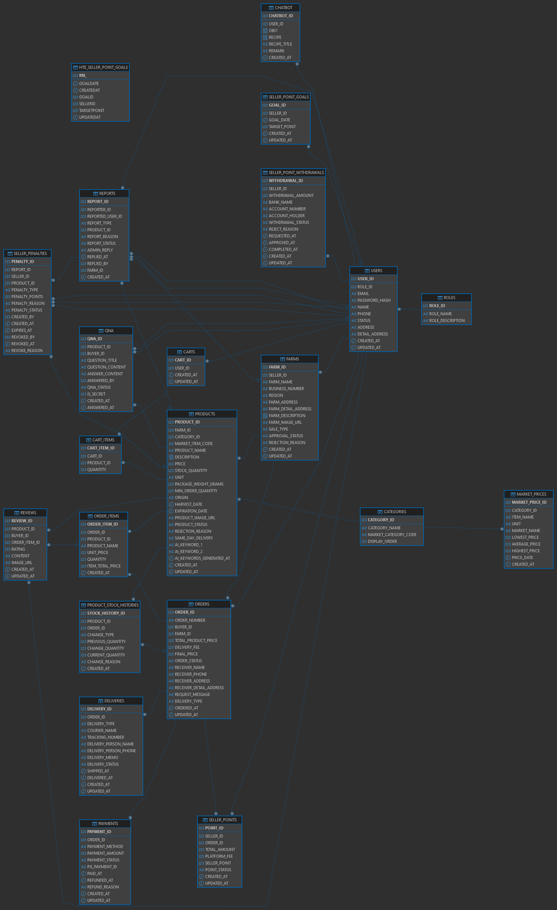

# 농담 (Nongdam)

공공 농산물 시세와 산지 상품을 연결하는 도매·소매 통합 거래 플랫폼입니다.

구매자는 시세와 상품 가격을 비교해 주문·결제할 수 있고, 판매자는 농장·상품·주문·배송·정산을 관리할 수 있습니다. 관리자는 회원, 승인, 신고, 콘텐츠, 결제와 배송 등 서비스 운영 전반을 관리합니다.

## GitHub

- 저장소: [https://github.com/shin-cj/project_farm.git](https://github.com/shin-cj/project_farm.git)

```bash
git clone https://github.com/shin-cj/project_farm.git
cd project_farm
```

## 프로젝트 목표

- 공공데이터를 활용해 농산물 시세를 이해하기 쉽게 제공
- 도매와 소매 상품을 한 서비스에서 구분하여 거래
- 주문부터 결제, 배송, 구매 확정, 판매자 정산까지 하나의 흐름으로 연결
- 구매자, 판매자, 관리자 역할에 맞는 전용 화면과 관리 기능 제공

## 주요 기능

### 구매자

- 도매·소매 상품 목록, 카테고리 검색 및 상품 상세 조회
- 오늘의 농산물 시세, 가격 변동률과 사이트 판매가 비교
- 장바구니 주문 및 상품 상세 페이지 바로 주문
- 토스페이먼츠 테스트 결제 승인과 주문 상태 확인
- 전체·부분 취소, 환불 요청 및 환불 상태 확인
- 주문 내역, 배송 조회와 구매 확정
- 구매 상품 리뷰 및 상품 문의 작성·수정·삭제
- 비밀 문의 보호, 신고 접수 및 처리 결과 확인
- OpenAI 기반 레시피 추천과 추천 재료의 판매 상품 연결

### 판매자

- 판매자 대시보드에서 매출, 주문 및 배송 현황 확인
- 농장 등록·수정과 관리자 승인 상태 확인
- 도매·소매 상품 등록, 수정, 재고 및 판매 상태 관리
- 농장별 주문 접수, 택배사·송장번호 등록과 배송 상태 관리
- 기간별 매출, 주문 수, 인기 상품과 농장별 판매 통계 조회
- 구매 확정 주문의 판매 포인트 정산
- 일일 판매 목표 설정 및 포인트 출금 신청
- 신고 및 판매자 제재 내역 확인

### 관리자

- 운영 대시보드에서 회원, 주문, 매출, 신고 현황 확인
- 회원 검색, 권한 및 계정 상태 관리
- 농장·상품 등록 승인과 반려 사유 관리
- 주문, 결제, 취소, 환불 및 배송 현황 관리
- 리뷰 삭제와 상품 문의 답변·삭제 사유 관리
- 신고 답변, 판매자 제재 및 제재 해제
- 판매자 포인트 출금 요청 승인·반려
- 공공 농산물 시세 데이터 조회 및 동기화

## 서비스 흐름

```text
React 화면
  → API 요청
  → Spring Controller
  → Service 비즈니스 로직
  → JPA Repository
  → Oracle Database
  → JSON 응답
  → React 화면 갱신
```

주문과 결제는 다음 순서로 진행됩니다.

```text
상품 선택 → 장바구니 또는 바로 주문 → 주문 정보 확인
→ 토스 결제 요청 → 백엔드 결제 승인 → 주문 상태 변경
→ 판매자 주문 접수 → 배송 등록 → 배송 완료
→ 구매 확정 → 판매자 포인트 정산
```

## 기술 스택

**Frontend**  
`React 19` · `React Router 7` · `Axios` · `Vite 8`

**Backend**  
`Java 17` · `Spring Boot 4.1` · `Spring Web MVC` · `Spring Data JPA`

**Database**  
`Oracle Database` · `Hibernate` · `Oracle JDBC`

**Payment & AI**  
`Toss Payments SDK` · `Toss Payments REST API` · `OpenAI API`

**Public & External API**  
`공공데이터포털 농산물 가격 API` · `Pexels API` · `Daum 우편번호 서비스`

**Development Tools**  
`IntelliJ IDEA` · `DBeaver` · `GitHub Desktop`

## 프로젝트 구조

```text
project_farm/
├─ back/SpringBootBack/          Spring Boot 백엔드
├─ front/react-front-project/    React 프론트엔드
├─ database/setup/               최신 Oracle DB 구성 SQL
├─ database/final-dummy/         추가 더미 데이터
├─ database/erd/                 ERD 자료
├─ docs/                         프로젝트 문서
├─ uploads/                      개발 환경 업로드 파일
├─ farms.png                     README용 ERD 이미지
└─ README.md
```

## ERD



### 주요 테이블 관계

- `users`는 역할에 따라 구매자, 판매자, 관리자로 구분
- 판매자는 `farms`를 등록하고 농장은 여러 `products`를 보유
- 구매자의 `carts`에는 여러 `cart_items`가 저장
- `orders`는 주문 기본 정보, `order_items`는 주문 상품 정보를 저장
- 주문은 `payments`, `deliveries`와 연결되어 결제와 배송 상태를 관리
- 구매 확정 주문은 `seller_points`에 판매자 정산 포인트로 반영
- `reviews`, `qna`, `reports`에서 후기, 문의, 신고 정보를 관리

## SQL 파일

GitHub 프로젝트의 [`database/setup`](https://github.com/shin-cj/project_farm/tree/main/database/setup) 폴더에 최신 Oracle SQL 파일이 포함되어 있습니다.

| 실행 순서 | 파일 | 역할 |
|-------| --- | --- |
| 1     | `01_nongdam_reset_schema.sql` | 기존 농담 테이블과 시퀀스를 제거하고 최신 구조 생성 |
| 2     | `02_nongdam_dummy_data.sql` | 개발 및 화면 확인용 더미 데이터 등록 |
| 3     | `04_nongdam_package_weight_backfill.sql` | 기존 상품의 포장 중량 데이터 보완 |
| 4     | `05_nongdam_market_item_code_backfill.sql` | 기존 상품의 시세 품목 코드 데이터 보완 |

> `01_nongdam_reset_schema.sql`은 현재 스키마의 관련 테이블과 데이터를 삭제한 뒤 다시 생성하는 파일입니다.

새 개발 DB를 구성할 때 DBeaver 또는 Oracle SQL Developer에서 `01`부터 `04`까지 번호 순서대로 실행합니다.

## 실행 전 준비

- Java 17
- Node.js 20 이상 및 npm
- Oracle Database XE
- DBeaver 또는 Oracle SQL Developer
- 공공데이터포털 API 키
- OpenAI API 키
- Pexels API 키
- 토스페이먼츠 테스트 키

## 백엔드 실행 방법

### 1. 데이터베이스 연결 설정

`back/SpringBootBack/src/main/resources/application.yml`의 Oracle 계정 정보를 자신의 환경에 맞게 설정합니다.

```yaml
spring:
  datasource:
    driver-class-name: oracle.jdbc.OracleDriver
    url: jdbc:oracle:thin:@localhost:1521:xe
    username: YOUR_ORACLE_USERNAME
    password: YOUR_ORACLE_PASSWORD
```

### 2. 환경변수 설정

인텔리제이를 기준으로 백엔드 환경변수 편집에 해당 api를 추가.

```
API01_KEY="YOUR_PUBLIC_DATA_API_KEY"
OPENAI_API_KEY="YOUR_OPENAI_API_KEY"
```

토스페이먼츠 시크릿 키는 `application.yml`의 다음 항목에 테스트 키로 설정합니다.

```yaml
tosspayments:
  secret-key: YOUR_TOSS_TEST_SECRET_KEY
```

### 3. 백엔드 실행

```
cd back\SpringBootBack
.\gradlew.bat bootRun
```

- 백엔드 주소: `http://localhost:8080`

## 프론트엔드 실행 방법

새 터미널을 열고 다음 명령을 실행합니다.

```
cd front\react-front-project
npm install
npm run dev
```

- 프론트엔드 주소: `http://localhost:5173`
- Vite가 `/api`, `/price-api`, `/uploads` 요청을 `http://localhost:8080`으로 전달합니다.

## 실행 순서 요약

1. 저장소를 Clone
2. Oracle 계정과 스키마 준비
3. `database/setup`의 SQL을 `01`부터 `05`까지 실행
4. `application.yml`의 DB 정보와 토스 테스트 키 설정
5. 외부 API 환경변수 설정
6. Spring Boot 백엔드 실행
7. React 프로젝트에서 `npm install` 후 `npm run dev` 실행
8. 브라우저에서 `http://localhost:5173` 접속

## 참고 사항

- 결제 기능은 토스페이먼츠 테스트 환경을 기준으로 구성되어 있습니다.
- 공공데이터는 API 호출 제한, 휴일과 제공 기관의 갱신 주기에 따라 결과가 달라질 수 있습니다.
- 업로드한 상품과 농장 이미지는 개발 환경의 `uploads` 폴더에 저장됩니다.
- 역할 번호는 `1=관리자`, `2=구매자`, `3=판매자`로 사용합니다.
- 전체 기능을 확인하려면 Oracle DB, 백엔드와 프론트엔드를 모두 실행해야 합니다.
